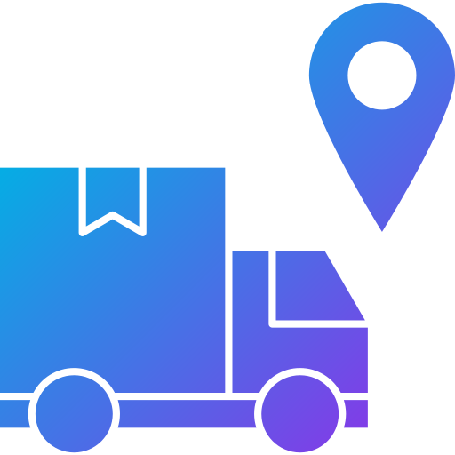

<div align="center">



# TransitOps

**Enterprise Fleet Management & Intelligence Platform**

[](https://nodejs.org)
[](https://react.dev)
[](https://mongodb.com)
[](https://vitejs.dev)
[](https://expressjs.com)
[](https://tailwindcss.com)

*A unified, AI-powered fleet operations platform built for modern logistics enterprises*

</div>

---

## Overview

TransitOps is a full-stack, enterprise-grade fleet management system that consolidates vehicle registries, driver compliance, live GPS intelligence, route dispatching, maintenance scheduling, and financial auditing into a single premium command center.

The platform is designed with a **dark-first premium UI** inspired by leading SaaS products like Samsara, Motive, and Tesla Fleet — featuring real-time SVG telemetry animations, Framer Motion transitions, geofence canvas drawing, and an AI operations copilot.

---

## Features

### 🗺️ Fleet Intelligence Map
- **Live Bezier GPS Tracking** — Vehicles crawl smoothly along curved interstate highway vectors (I-5, I-10, I-80, I-90) with real-time heading rotation
- **Live Telemetry Tooltips** — Hover any vehicle for speed, fuel level, coolant temperature, brake wear, and cargo weight
- **Vehicle Detail Drawer** — Click any vehicle to open a full-panel sidebar with tire pressures, DMV records, assigned driver, and diagnostics
- **Weather Radar Overlay** — Dynamic storm cells and fog advisories with AI-suggested reroutes
- **Geofence Designer** — Draw and save custom boundary polygons (Restricted, Terminal, Warehouse, Speed-Limit) directly on the map canvas
- **Traffic & Violation Heatmaps** — Radial gradient overlays for traffic density, speed violations, and idle time hotspots

### 🏠 Command Center Dashboard
- **Operations Grid** — Real-time KPI cards for active trips, online drivers, daily fuel volumes, and earnings with trend sparklines
- **Revenue & Cost Charts** — Switchable Line, Area, and Bar views comparing fuel, maintenance, and net yield data
- **System Status Bar** — Live API latency, database status, local clock, and GPS sync indicators
- **Notification Drawer** — Slide-out alert center with severity filtering (Critical, Operational, System) and bulk management

### 🚛 Vehicle Registry
- Complete fleet inventory with registration numbers, models, types (Van, Truck, Reefer, Flatbed, Sedan), payload limits, odometer readings, and acquisition costs
- Vehicle status lifecycle: `Available` → `On Trip` → `In Shop` → `Retired`
- Unique registration number enforcement at the database level

### 👤 Driver Profiles
- CDL license classification tracking (Class A, B, C) with expiry alerts
- Safety score ratings (0–100) per driver with AI-flagged incident reports
- Document attachments (CDL certificates, medical exams, road test records)
- Driver status lifecycle: `Available` → `On Trip` → `Off Duty` → `Suspended`

### 🗓️ Dispatch Board
- Create, dispatch, complete, and cancel trip assignments
- **Business Rule Enforcement**:
  - Cargo weight validated against vehicle max load capacity
  - Retired or In-Shop vehicles blocked from dispatch pools
  - Drivers with expired licenses or suspended status automatically rejected
  - Vehicles and drivers marked `On Trip` cannot be double-assigned
- Odometer auto-updates and fuel logging on trip completion
- Confetti celebration animation on successful dispatch

### 🔧 Maintenance Shop
- Log service tickets with description, cost, and priority
- Check-in sets vehicle status to `In Shop`, locking it from dispatch
- Closing a ticket restores vehicle to `Available` with cost saved to history

### 💰 Expense Ledger
- Record operational expenses by category: `Tolls`, `Maintenance`, `Permits`, `Other`
- Fuel log tracking with volume (gallons) and station location
- Invoice receipt file attachments with a dark-themed preview panel
- Costs feed into the Dashboard financial trend charts

### 📊 Reports & Analytics
- Weekly trip volume trends and completion rates
- Fuel usage aggregations per vehicle and per region
- Maintenance cost breakdowns and driver compliance summaries

### 🤖 AI Command Copilot
- Natural language query interface for fleet operations
- Terminal-style fast responses for audit queries (e.g. *"Which vehicles are in the shop?"*, *"List high-risk drivers"*)

---

## Tech Stack

| Layer | Technology | Version |
|---|---|---|
| Frontend Framework | React | 19 |
| Build Tool | Vite | 8 |
| Styling | Tailwind CSS | 4 |
| Animations | Framer Motion | 12 |
| Icons | Lucide React | 1.24 |
| PDF Export | jsPDF | 4 |
| Confetti | canvas-confetti | 1.9 |
| Backend Runtime | Node.js | 18+ |
| API Framework | Express | 4 |
| Database | MongoDB | — |
| ODM | Mongoose | 8 |
| Auth | JSON Web Tokens (JWT) | 9 |
| Password Hashing | bcryptjs | 2.4 |

---

## Project Structure

```
TransitOps/
├── start.js                    # Root orchestrator — spawns backend + frontend concurrently
│
├── backend/
│   ├── server.js               # Express app entry point, route mounting, MongoDB connect
│   ├── seed.js                 # Database seeder with mock fleet data
│   ├── middleware/
│   │   └── auth.js             # JWT authenticateToken + requireRole middleware
│   ├── models/
│   │   ├── User.js             # User schema with bcrypt password hooks
│   │   ├── Vehicle.js          # Vehicle schema (status lifecycle enforced)
│   │   ├── Driver.js           # Driver schema with CDL fields and documents array
│   │   ├── Trip.js             # Trip schema (Draft → Dispatched → Completed/Cancelled)
│   │   ├── Maintenance.js      # Maintenance ticket schema (Active → Closed)
│   │   ├── Expense.js          # Expense schema (Tolls, Maintenance, Permits, Other)
│   │   └── FuelLog.js          # Fuel log schema linked to vehicle and trip
│   └── routes/
│       ├── auth.js             # POST /login, POST /register
│       ├── vehicles.js         # CRUD for fleet vehicles
│       ├── drivers.js          # CRUD for driver profiles + document upload
│       ├── trips.js            # Create, dispatch, complete, cancel trip workflows
│       ├── maintenance.js      # Check-in and close maintenance tickets
│       ├── expenses.js         # Log and retrieve operational expenses
│       └── reports.js          # Aggregated analytics and reporting queries
│
└── frontend/
    ├── index.html              # Root HTML with favicon (logistic.png) and font preloads
    ├── vite.config.js          # Vite build configuration
    ├── tailwind.config.js      # Tailwind theme tokens
    └── src/
        ├── main.jsx            # React entry point
        ├── App.jsx             # Root app: sidebar, navbar, routing, auth guard
        ├── api.js              # Axios-based API client with auth header injection
        ├── index.css           # Global CSS, dark theme tokens, custom scrollbar
        ├── components/
        │   ├── Charts.jsx      # Recharts wrapper components (Line, Bar, Area, Donut)
        │   └── CommandPalette.jsx  # Global ⌘K search/command palette
        └── pages/
            ├── Landing.jsx     # Public marketing landing page
            ├── Login.jsx       # Role-based authentication gateway
            ├── Dashboard.jsx   # Command center with KPI grid and live map widget
            ├── FleetMap.jsx    # Full GPS intelligence map (Bezier, geofences, heatmaps)
            ├── Vehicles.jsx    # Vehicle registry with slide-out detail drawer
            ├── Drivers.jsx     # Driver profiles with CDL and safety compliance drawers
            ├── Trips.jsx       # Dispatch board with trip lifecycle management
            ├── Maintenance.jsx # Maintenance shop ticket manager
            ├── Expenses.jsx    # Expense ledger with fuel logs and receipt preview
            ├── Reports.jsx     # Analytics charts and compliance reports
            └── AISearch.jsx    # AI Command Copilot terminal interface
```

---

## API Reference

### Authentication
| Method | Endpoint | Access | Description |
|---|---|---|---|
| `POST` | `/api/auth/login` | Public | Login and receive JWT |
| `POST` | `/api/auth/register` | Public | Register a new user account |

### Vehicles
| Method | Endpoint | Access | Description |
|---|---|---|---|
| `GET` | `/api/vehicles` | All roles | List all vehicles |
| `POST` | `/api/vehicles` | Fleet Manager | Register a new vehicle |
| `PUT` | `/api/vehicles/:id` | Fleet Manager | Update vehicle details |
| `DELETE` | `/api/vehicles/:id` | Fleet Manager | Remove a vehicle |

### Drivers
| Method | Endpoint | Access | Description |
|---|---|---|---|
| `GET` | `/api/drivers` | All roles | List all drivers |
| `POST` | `/api/drivers` | Fleet Manager | Register a new driver |
| `PUT` | `/api/drivers/:id` | Fleet Manager | Update driver profile |
| `DELETE` | `/api/drivers/:id` | Fleet Manager | Remove a driver |

### Trips
| Method | Endpoint | Access | Description |
|---|---|---|---|
| `GET` | `/api/trips` | All roles | List all trips (filterable by status) |
| `POST` | `/api/trips` | Fleet Manager, Driver | Create a new trip (Draft state) |
| `POST` | `/api/trips/:id/dispatch` | Fleet Manager, Driver | Dispatch a draft trip |
| `POST` | `/api/trips/:id/complete` | Fleet Manager, Driver | Complete a dispatched trip |
| `POST` | `/api/trips/:id/cancel` | Fleet Manager, Driver | Cancel a trip |

### Maintenance
| Method | Endpoint | Access | Description |
|---|---|---|---|
| `GET` | `/api/maintenance` | All roles | List all maintenance tickets |
| `POST` | `/api/maintenance` | Fleet Manager | Create a service ticket |
| `POST` | `/api/maintenance/:id/close` | Fleet Manager | Close a ticket and restore vehicle |

### Expenses & Reports
| Method | Endpoint | Access | Description |
|---|---|---|---|
| `GET` | `/api/expenses` | All roles | List expenses (fuel logs, tolls, permits) |
| `POST` | `/api/expenses` | All roles | Record a new expense |
| `GET` | `/api/reports` | All roles | Fetch aggregated analytics data |

---

## Installation & Setup

### Prerequisites
- Node.js `v18` or higher
- MongoDB running locally or a [MongoDB Atlas](https://mongodb.com/atlas) connection URI

### 1. Clone the Repository
```bash
git clone https://github.com/Vaishnavidasyam/odoo-hackathon-2026-TransitOps-.git
cd odoo-hackathon-2026-TransitOps-
```

### 2. Configure Environment
Create a `.env` file inside the `backend/` directory:
```env
PORT=5000
MONGODB_URI=mongodb://127.0.0.1:27017/transitops
JWT_SECRET=your_secret_key_here
```

### 3. Install Dependencies
```bash
# Backend
cd backend
npm install

# Frontend
cd ../frontend
npm install
```

### 4. Seed the Database (Recommended)
Populate MongoDB with sample vehicles, drivers, trips, maintenance records, and expenses:
```bash
cd backend
npm run seed
```

### 5. Launch the Platform
From the project root, the orchestrator script starts both servers concurrently:
```bash
node start.js
```

| Service | URL |
|---|---|
| React Frontend | http://localhost:5173 |
| Express API | http://localhost:5000 |

---

## Demo Credentials

All accounts share the same default password: **`password123`**

| Role | Name | Email |
|---|---|---|
| Fleet Manager | Marcus Sterling | `manager@transitops.com` |
| Safety Officer | Sarah Connor | `safety@transitops.com` |
| Financial Analyst | David Croft | `finance@transitops.com` |
| Driver | Alex Mercer | `driver@transitops.com` |

> Use the **Quick Access** role cards on the login screen to sign in instantly without typing credentials.

---

## Data Models

### Vehicle Status Lifecycle
```
Available ──► On Trip ──► Available
    │
    └──► In Shop ──► Available
    │
    └──► Retired
```

### Trip Status Lifecycle
```
Draft ──► Dispatched ──► Completed
                │
                └──► Cancelled
```

### Driver Status Lifecycle
```
Available ──► On Trip ──► Available
    │
    └──► Off Duty
    │
    └──► Suspended
```

---

## Business Rules

The backend enforces the following constraints server-side:

1. **Cargo Validation** — Trip cargo weight cannot exceed the vehicle's `maxLoadCapacity`
2. **Availability Enforcement** — Only vehicles with `Available` status appear in dispatch pools
3. **License Compliance** — Drivers with expired or suspended licenses are blocked from dispatch
4. **Double-Assignment Prevention** — A vehicle or driver already `On Trip` cannot be assigned to another active trip
5. **Status Cascades** — Dispatching a trip sets both vehicle and driver to `On Trip`; completing or cancelling restores them to `Available`
6. **Maintenance Lock** — Vehicles checked in to the shop (`In Shop`) are excluded from all dispatch operations until the ticket is closed
7. **Odometer Integrity** — Trip completion final odometer must be greater than the vehicle's current odometer reading

---

## Built For

**Odoo Hackathon 2026**

*Submitted by [Vaishnavidasyam](https://github.com/Vaishnavidasyam),[RahulGoolagattu](https://github.com/GRahul9989
)*
